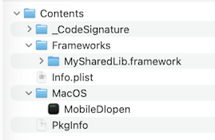
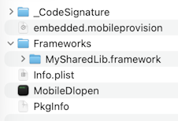
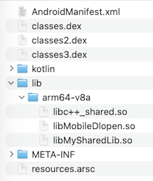

## Package bundle structure
| Platform | Structure | Shared lib. placement |
|----------|-----------|-----------------------|
| macOS    |  | `Contents/Frameworks` folder (`@executable_path/../Frameworks`) | 
| iOS      |  | `Frameworks` folder (`@executable_path/Frameworks`) |
| Android  |  | `lib/arm64-v8a` folder (same as entry-point shared lib.) |

The **MobileDlopen** project demonstrates how to use `std::filesystem::directory_iterator` for iterating over all shared libs. in package bundles for the above platforms. Is also shows how to open (with `open`/`fopen`) and load (with `dlopen`) the run-time detected shared libs.

## File embedding samples
Sample code for embedding arbitrary binary or text files into Mach-O and ELF binaries on various platforms.

### Platform support
| Platform | Approach |
|----------|----------------|
| Windows  | Use [`RCDATA`](https://learn.microsoft.com/en-us/windows/win32/menurc/rcdata-resource) resources to embed arbitrary files into a `.dll` or `.exe`. |
| Linux/Android | Add a named `.dynsym` symbol to the `.so` ELF binary. |
| macOS/iOS     | Add a named `__TEXT` symbol to the `.dylib` Mach-O binary.|

### Cross-platform alternative
[`#embed`](https://en.cppreference.com/cpp/preprocessor/embed) that's introduced in C23/C++26 can be used as portable solution for arbitrary file embedding. There  **incbin** sample furthermore demonstrates how achieve the same with pre-C23/C++26 compilers.

#### Demonstrates the following
* Embed arbitrary binary files in shared libraries
* Access the embedded files without running the binary

## Documentation
* [OS X ABI Mach-O File Format Reference](https://github.com/aidansteele/osx-abi-macho-file-format-reference)
* https://lowlevelbits.org/parsing-mach-o-files/
* [Mach-O Viewer](https://github.com/terrakok/Mach-O-viewer)
* CMake [FRAMEWORK](https://cmake.org/cmake/help/latest/prop_tgt/FRAMEWORK.html) support
* [`dlopen` limitations on iOS](https://stackoverflow.com/questions/17829201/is-dlopen-use-inside-a-static-library-in-ios-allowed) - Using dlopen with literal parameters is ok
* Mach-O file format [4GB Limit](https://jonasdevlieghere.com/post/macho-4gb-limit/) also in 64bit

### Samples
* GitHubb [sheldonth/ios-cmake](https://github.com/sheldonth/ios-cmake) sample with dynamic framwork sample
